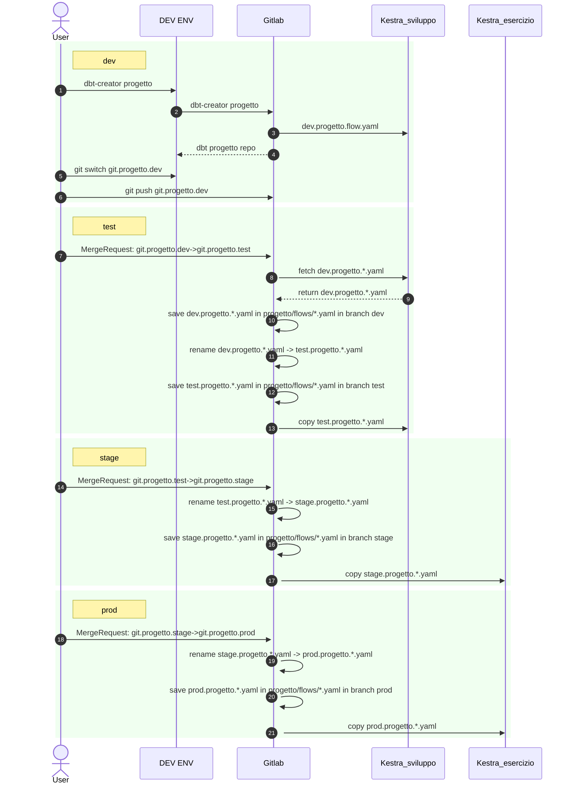

**Regole e flusso per promozione dei progetti dbt e delle pipeline di orchestrazione tra i vari ambienti**

GESTIONE SEQUENZIALE PUSH e SYNC
- su singolo progetto (approfondire progetti con + flow)
GESTIONE STATO FLOW KESTRA su istanza DEV / namespace dev
- attualmente vive solo su Kestra
- deve essere l'unica modificabile
- deve essere salvata su git (come prima operazione della MR dev->test)
GESTIONE NOTIFICHE DELL'AVVENUTO AVANZAMENTO FASE

**PROPOSTA**
- **==utilizzare cartella /flows/ sui progetti dbt invece che repo KestraFlow==**

# DIAGRAMMA SEQUENCE

---

## AMBIENTI

Kubernetes: due ambienti separati mediante namespace 
- sviluppo
- esercizio

Nell'ambiente sviluppo abbiamo i seguenti ambienti per dati e pipeline:
- dev (ambiente di sviluppo)
- test (ambiente di test)

Nell'ambiente esercizio abbiamo i seguenti ambienti per dati e pipeline:
- stage (ambiente di pre-produzione)
- prod (ambiente di produzione)

---

## ATTORI

- Utente Sviluppatore
- GitLab
- Kestra_sviluppo 
- Kestra_esercizio 

### Utente Sviluppatore
Utente sviluppatore dei progetti dbt

Ruolo:
- Responsabile dello sviluppo e test dei processi dbt
	- sviluppo in ambiente DEV
- Effettua le Merge Request per la promozione dei processi
	- da ambiente DEV ad ambiente TEST
	- da ambiente TEST ad ambiente STAGE (con cambio di cluster Kubernetes)
	- da ambiente STAGE ad ambiente PROD
### GitLab
Repository del codice sorgente.

Le repository contenute su GitLab sono:
1. Repository del template cookie-cutter del progetto dbt (in ==/dbt/models/cookiecutter-dbt-template-kestra==) a partire dal quale vengono create le repository dei singoli progetti dbt
2. Repository dei progetti dbt (in ==/data-platform/dbt/==) creati a partire dal template. Ogni repository contiene:
		1. il progetto con il codice e la configurazione di dbt
		2. una directory /flows/ che contiene il flow base Kestra definito in un file \<progetto\>.yaml. Durante l'inizializzazione del progetto questo file viene inviato a Kestra per essere in grado di poter orchestrare la pipeline.
		3. un file .gitlab-ci.yml che contiene la definizione della procedura ci/cd per le pipeline Kestra 
			1. stage deploy_TEST: copia pipeline kestra da dev a test 
			2. stage deploy_STAGE: copia pipeline kestra da test a stage 
			3. stage deploy_PROD: copia pipeline kestra da stage a prod 
		4. uno script python per la gestione del processo dbt (esecuzione, documentazione e versioning su git)
	 I vari ambienti sono gestiti tramite appositi branch

I ruoli svolti da GitLab sono:
- Gestione del versioning e del branching delle repository descritte
- Gestione della procedura di ci/cd per la promozione dei seguenti artefatti nei vari ambienti effettuata attraverso un meccanismo di Merge Request:
	- Progetto dbt (viene effettuata commit su relativo branch target)
	- Pipeline Kestra (invio della definizione della pipeline nel relativo namespace Kestra e gestione dei flow Kestra nella cartella /flows del progetto dbt)

### Kestra
Orchestratore delle pipeline dbt e ausilio nella procedure ci/cd. 

Esistono due istanze Kestra separate:
- Kestra_sviluppo (sviluppo/test)
- Kestra_esercizio (staging/produzione)

Entrambi contengono:
- Pipeline di esecuzione dei progetti dbt separate mediante namespace all'interno di kestra
	- dev.progettodbt (DEV)
	- test.progettodbt (PROD)
	- stage.progettodbt (STAGE)
	- prod.progettodbt (PROD)

Il passaggio dei flow kestra tra i vari ambienti viene gestito dalla procedura ci/cd utilizzando i flow definiti nella cartella /flows del progetto dbt 

Responsabilità:
- Esecuzione delle pipeline dei progetti dbt 

---

## FASI

### FASE 0 - SVILUPPO

**Utente esegue Script dbt-creator**. Lo script crea: 
- **Il progetto dbt** configurato con il profilo "dev" e con il brach git "dev" 
- **Configurazione pipeline kestra** (nella dir "flows/" del progetto) che contiene il file yaml kestra: serve per inizializzare il flow su kestra (su namespace dev.progetto).
	- L'inizializzazione viene effettuata dalla procedura dbt-creator.
- **Pipeline ci/cd Gitlab** (in file .gitlab-ci.yaml) contenente la procedura per copiare il progetto dbt e le pipeline Kestra tra vari ambienti (dev->test->stage->prod)

**Utente sviluppa il progetto dbt** 
- Lo sviluppo avviene nell'ambiente di sviluppo VS Code / Jupyter e viene pushato su Gitlab sul branch dev

**Utente sviluppa la pipeline Kestra** 
- Lo sviluppo della pipeline avviene sul client Kestra

### FASE 1 - DEV -> TEST 

**PRE-CONDIZIONI**
- Sorgenti configurate su Dremio e OpenMetadata
- Progetto dbt funzionante e pushato su branch dev
- Pipeline sviluppata su Kestra seguendo  le linee guida

**Passaggio da dev a test**
1. Sviluppatore effettua una **Merge Request**
2. L'apertura della Merge Request determina l'esecuzione della pipeline ci/cd nello stage TEST. 
	Le operazioni effettuate sono:
			1. curl (GET) delle pipeline da Kestra_sviluppo (namespace dev) 
			2. salvataggio delle pipeline sul branch dev del progetto dbt (nella cartella /flows/)
			3. cambio namespace (dev -> test) delle pipeline 
			4. salvataggio delle pipeline test sul branch test del progetto dbt (nella cartella /flows/)
			5. curl (POST) delle pipeline test su Kestra_sviluppo (con namespace test)
			6. merge del codice del progetto su branch test 
			7. modifica della configurazione dbt del branch test (profiles.yaml)
3. A questo punto il progetto dbt e le pipeline Kestra sono disponibili sull'ambiente test
4. Viene eseguita la pipeline Kestra per verificarne la correttezza in ambiente di test
5. Esecuzione dei test del pre-commit (dbt-checkpoint)
	1. test base standard hard-coded in CI/CD
	2. test custom definiti dall'utente su file separato su progetto dbt e lanciato opportunamente da pipeline Kestra
6. Viene effettuata la ingest dei metadati dremio e dbt (da una pipeline kestra parametrizzata  e indipendente)
7. A questo punto se OK l'utente può approvare la Merge Request

NOTE 
- in questo passaggio non viene eseguito dbt-osmosis yaml refactor
- output della pipeline ci/cd visualizza alla fine i link per utente con 
	- dataset dremio
	- schede omd
	- log kestra
	- log opensearch

### FASE 2 - DA TEST A STAGE

**Passaggio da test a stage**
1. Utente effettua una **Merge Request**
2. L'apertura della Merge Request determina 
	1. la merge del codice dbt sul branch stage con profilo dbt stage
	2. l'esecuzione della pipeline ci/cd (.gitlab-ci.yaml) nello stage deploy_STAGE. Le operazioni effettuate sono:
			1. cambio namespace (test -> stage) delle pipeline (lettura da repo git branch test e scrittura su branch stage)
			2. salvataggio delle pipeline modificate sul branch stage del progetto dbt (nella cartella /flows/)
			3. curl (POST) delle pipeline stage su Kestra_esercizio (con namespace stage) 
3. A questo punto il progetto dbt e le pipeline Kestra sono disponibili sull'ambiente stage 
4. Viene eseguita la pipeline Kestra per verificarne la correttezza in ambiente di test
5. Se esito OK. Approvazione Merge Request
6. Se esito KO. NON approvazione Merge Request.

### FASE 3 - DA STAGE A PROD

**Passaggio da stage a prod**
1. Utente effettua una **Merge Request**
2. L'approvazione della Merge Request determina 
	1. la merge del codice dbt sul branch prod con profilo dbt prod
	2. l'esecuzione della pipeline ci/cd (.gitlab-ci.yaml) nello stage deploy_PROD. Le operazioni effettuate sono:
			1. cambio namespace (stage -> pro) delle pipeline (lettura da repo git branch stage e scrittura su branch prod)
			2. salvataggio delle pipeline modificate sul branch prod del progetto dbt (nella cartella /flows/)
			3. curl (POST) della pipeline su Kestra_esercizio (con namespace prod) 
3. A questo punto il progetto dbt e la pipeline Kestra è disponibile sull'ambiente prod per l'esecuzione

